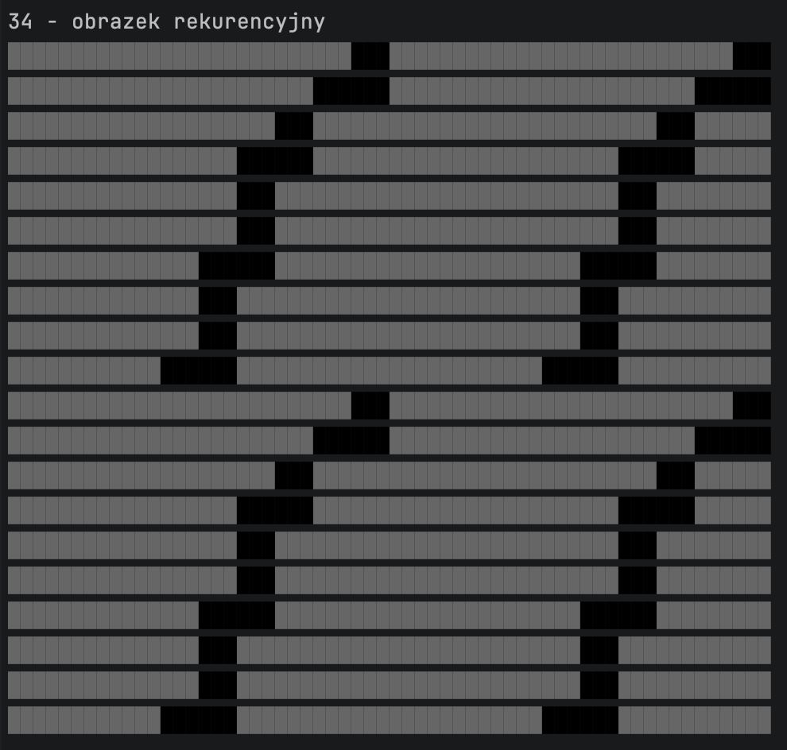
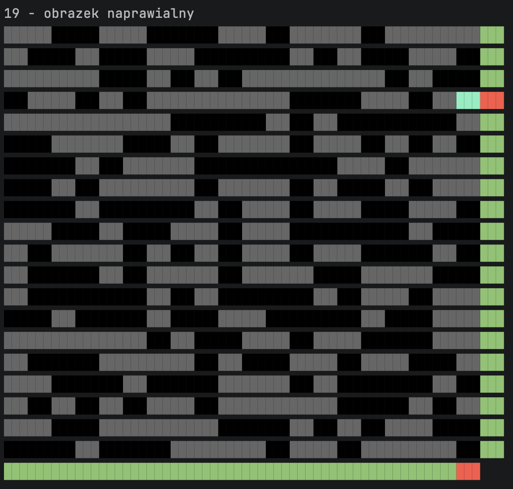

## Zadanie 64 – Analiza obrazków czarno-białych

Treść zadania znajduje się w pliku:  
`Resources/piksele.pdf`

### Wymagania
- Plik wejściowy **dane_obrazki.txt** musi znajdować się w katalogu:  
  `bin/Debug/net8.0`
- Wyniki działania programu są zapisywane do pliku:  
  `wyniki_obrazki.txt`

### Dodatkowe opcje wizualizacji
```csharp
bool enableVisualization = true;
```

powoduje wyświetlenie:
- wszystkich obrazków rekurencyjnych,
- wszystkich obrazków naprawialnych,
- wizualizacji pikseli lub bitów parzystości wymagających poprawy.


